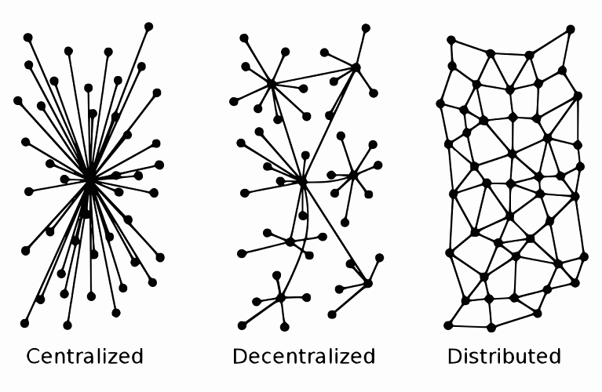
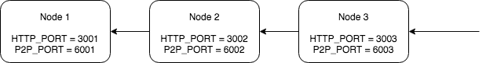

# Chapter 0: Decentralised System

> A purely peer-to-peer version of electronic cash would allow online payments to be sent directly from one party to another without going through a financial institution. - Bitcoin's Whitepaper

A peer-to-peer (P2P) network is a network in which interconnected nodes ("peers") share resources amongst each other without the use of a centralized administrative system. This technology is not new as we have seen it being used in Napster and BitTorrent.



* Centralised System - The most common system we see today. Centralised control means single point of failure.

* Distributed System - Distribute part of the resource to other nodes in the network but could still be centrally controlled with points of failure.

* Decentralised System - Every node is fully redundant with no points of failure.

## The CAP Theorem

In a distributed system, the [CAP Theorem] (aka Brewer's theorem) says that it is only possible to get at most 2 out of 3 of the following properties:

Consistency: Every read gets the same data with minimum delay (speed).
Availability: There is enough nodes in the system to allow redundancies (cost).
Partition tolerance: The system continues to function even if some nodes are malfunctioning or malicious (security).

## Creating a Simple P2P System with WebSocket

[WebSockets](https://en.wikipedia.org/wiki/WebSocket) allow a long-held single TCP socket connection to be established between the client and server which allows for bi-directional, full duplex, messages to be instantly distributed with little overhead resulting in a very low latency connection.

Let us assume that we have 3 nodes in our decentralised system.

* Node 1 is not connected to anyone. (HTTP_BASE_PORT=3000, P2P_BASE_PORT=6000)
* Node 2 is connected to Node 1. (http port plus 1 based on node 1, p2p port plus 1 based on node 1) 
* Node 3 is connected to Node 2. (http port plus 2 based on node 1, p2p port plus 2 based on node 1)



The connected nodes gossip with each other to transfer data. If the ledger in Node 3 is updated, the data will be broadcasted to Node 2 and eventually to Node 1 or vice versa.

We will be using this simple network throughout all the chapters of the course. The simplicity of the network is also a limitation. If any node is serving other nodes as clients that to be broken, these clients are broke up with network.

**The idea is to send HTTP request to node 3 and checking the results from Node 1. If decentralisation is working correctly, node 1 should return us the right results.**

Firstly, we create each node itself as a websocket server, it can serve multiple nodes as clients.

[P2pServer.go](P2pServer.go)

Secondly, as each connection from whatever client to be managed as registering and unregistering when it is connected and disconnected correspondingly.

[Client.go](Client.go)

Thirdly, each node by itself is a client too. It can connect to any node in the network.

[P2pClient.go](P2pClient.go)

Last but not least, we combine those stuffs into main file to wake it up.

[main.go](main.go)

## Testing

Open up 4 terminals. In the *directory root* of all the windows

Lets assign terminal 1 to node 1 and vice versa.

In Terminal 1, start the node

```
$ make
$ ./blockchain
```

In Terminal 2, start the node

```
$ PEER_NO=1 PEER=ws://localhost:6000 ./blockchain
```

In Terminal 3, start the node

```
$ PEER_NO=2 PEER=ws://localhost:6001 ./blockchain
```

Open the last Terminal. Let's call this terminal 4 and make a simple curl call to Node 3.

```
$ curl http://localhost:3002/ping
```

Now check terminal 1,2 and 3. Do they all display the same message? If yes, all the nodes are synchronised. Congratulations, you have created a very simple P2P network.

## Using Currencies in P2P network 

Unlike making digital copies of a file, using P2P network to replicate **real time** digital transactions means that all the nodes have to be synchronised with each other. **At the same time, the consensus makes sure that no one can erase or modify the transaction history and [double spend](https://en.wikipedia.org/wiki/Double-spending) the funds.**

Synchronising all the nodes is rocket science. There needs to be rules to group different transactions into blocks (batches) in order for synchronisation to work.

The more nodes we have, the slower and harder it is for the blocks to propagate. Most importantly, the network should be resilient to bad actors who propagate false transactional data. The network needs to be "smart" to know which blocks are legitimate and which is not. 

There might be many unanswered questions at this stage. Things will be clearer when we will revisit this issue at chapter 2.

## Food for Thought

Would you use decentralised or centralised systems for the following use cases and why? (ungraded)

* Creation of a national identity system for a country's citizens.
* A parcel tracking system for company xyz.
* Tracking of rice production between Vietnam and Australia.
* Voting for the next government.
* Record the transaction history of lotus miles (points) of vietnam airlines.

## Short Quiz

? A Distributed Ledger can be very decentralised, cheap to use and fast.

a) True
B) False

? Bitcoin is centralised because the core developers have full control over the source code.

a) True
B) False

## Resources 

* [Gossip Protocol](https://en.wikipedia.org/wiki/Gossip_protocol)