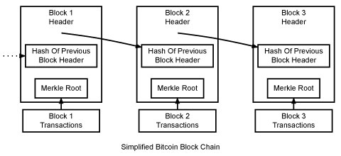

# Chapter 2: The Blockchain

> A timestamp server works by taking a hash of a block of items to be timestamped and widely publishing the hash, such as in a newspaper or Usenet post. The timestamp proves that the data must have existed at the time, obviously, in order to get into the hash. Each timestamp includes the previous timestamp in its hash, forming a chain, with each additional timestamp reinforcing the ones before it. - Bitcoin's Whitepaper

The Blockchain is simply a chain of blocks. In the technical term, it is an insert only database. The ecosystem ensures that the data in the Blockchain cannot be changed and hence protect against [double spending](https://en.wikipedia.org/wiki/Double-spending) when used as a currency.

Each block consists of transactions and the miner (node) is responsible to assemble all the transactions in the block.


*Image Credit: bitcoin.org*

Each transaction is hashed and then paired repeatedly until the last single hash remains (merkle root). The merkle root is stored in the block header referencing the previous block's merkle root, forming an immutable chain.

## The Block

Let us first create a simple block.

```
# [Block.go](Block.go)
```

The block has all the properties as we described previously. A big part of Blockchain is the hashing algorithm. We are using the same hashing algorithm that Bitcoin uses, ie SHA256.

Q1. What is the unique identifier in the Block? How do we ensure that its unique?

## The Transaction

Now lets create a simple Transaction object.

```
# [Transaction.go](Transaction.go)
```

Each Transaction records who is sending how much to who. This is a simple Account Based Transaction Model that scans through the chain to get the balance.

Q2. Do you see a problem with the Transaction class?

## The Chain

Now, the actual Blockchain class.

```
# [Blockchain.go](Transaction.go)

```

The actual implementation of the chain is quite simple. Its basically an incremental insert-only array of the Blocks object.

Q3. Why is there a need for pendingTransactions?

Q4. What is the problem with the getAddressBalance function in the Blockchain class?

Its time to add 4 more api endpoints to main.js, ie createTransaction, createBlock, getBlockchain and getBalance.

```
# [Transaction.go](main.go)

```

We broadcast to different nodes when new transactions and blocks are added. In this way, all the nodes are synced. Querying any nodes will return the same results.

## Testing

We are now going to create a transaction, add it to a block and verify that all the chain are in sync.

Open up 3 terminals, Lets assign terminal 1 to node 1 and vice versa.

In Terminal 1, start the node

```
$ make
$ ./blockchain
```

In Terminal 2, start the node

```
$ PEER_NO=1 PEERS=ws://localhost:6000 ./blockchain
```

In Terminal 3, start the node

```
$ PEER_NO=2 PEERS=ws://localhost:6001 ./blockchain
```

In Terminal 4, 

```
# Lets add a tx to node 3.
$ curl -H "Content-type:application/json" --data '{"fromAddress" : "alice", "toAddress" : "bob", "value" : 40}' http://localhost:3002/createTransaction

# create a block in node 3. Check what happens in all the terminals.
$ curl http://localhost:3002/createBlock

# check the chain in all the nodes. They should be the same
$ curl http://localhost:3002/getBlockchain
$ curl http://localhost:3001/getBlockchain
$ curl http://localhost:3000/getBlockchain

# get the balance of alice and bob from node 1. What values did you get?
$ curl http://localhost:3001/getBalance/alice
$ curl http://localhost:3001/getBalance/bob
```

Q5. Did you see any problems with alice sending 40 tokens to bob? How do we fix it? (ungraded)

## Short Quiz

? In Bitcoin, what happens when 2 miners find a block at the same time?

a) The Blockchain will use the chain of the miner that has the most nodes replicating its block.
b) The Blockchain will use the chain of the miner with the most number of transaction in its block, ie the heaviest chain.
c) The Blockchain will use the chain of the miner with the highest transaction fee in its block.
D) Nothing happens, the network continues to have 2 split chains.
e) None of the above.

? How can one person double spend in Bitcoin?

A) The attacker sends the coin to an address and receives a tx id. It then builds a fork that does not contain the tx id and hope that this fork will become the longest chain in the network.
b) The attacker sends 2 different transactions at the same time to the network. Only one of them is recorded in the Blockchain and the other one disappear due to race onditions. 
c) The attacker sends the coin to an address and receives a tx id. It then creates another transaction to cancel the previous transaction and get the funds back.
d) The attacker sends the coin to an address and receives a tx id. It then builds a fork containing the same tx id but with 0 btc, hoping that this fork will become the longest chain in the network.

## Resources

* [Bitcoin Developer Guide](https://bitcoin.org/en/developer-guide)