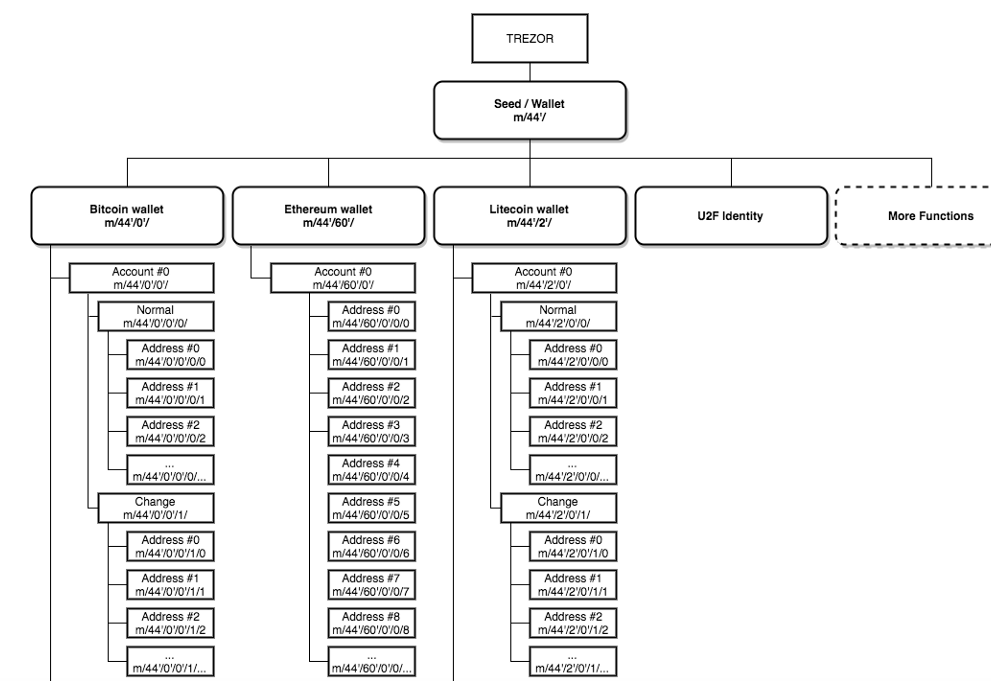

# Chapter 3: Public Key Cryptography

> What is needed is an electronic payment system based on cryptographic proof instead of trust, allowing any two willing parties to transact directly with each other without the need for a trusted third party. - Bitcoin's Whitepaper

[Public-key cryptography](Public-key_cryptography) is any cryptographic system that uses pairs of keys to ensure security between 2 parties. The public key can be disseminated widely and private key is only known to the owner. There are 2 objectives:

* The public key can verify that the private key signed a message.
* The private key can decrypt the message encrypted by the public key.

The cryptocurrency addresses that we have been using, ie alice, bob and miner were just examples. In the crypto world, each address is mathematically related to the public key. In our course, let's just assume each address is the public key for the sake of simplicity.


*Image credit: Wikipedia*

Before an amount can be spend from an account, the user needs to sign the transaction with his private key. Since the public key and transaction details are known, each nodes can verify that the owner is indeed the rightful owner of the account.

Instead of using the addresses "Alice" and "Bob", let us create a proper wallet for each one of them.

[Wallet.go](Wallet.go)

[secp256k1](https://en.bitcoin.it/wiki/Secp256k1) is a type of elliptic curve cryptography used by Bitcoin. We will be using it to generate the public and private key pair. 

Let us test it out.

```
$ make
$ ./blockchain -k

Private Key: 12b9b260b5c6f728a7e5aa4fcc795c2d9348520fe65083f753b8ad57e936a64d
 Public Key: cd32066a00013f9e8d2fe782b1d75fcf30b5895afa149306bae0a2a0a08eb38e75eb6a7523a3f0ff61355c75b64278e75221958e27da51d82c7b62dde8cf6c45
```

Q1. Why is Bitcoin address(eg 367f4YWz1VCFaqBqwbTrzwi2b1h2U3w1AF) much shorter than the public key we generated?

The randomness in the algorithm ensures that you get different public and private keys everytime you run it. So let us use the following keys:

```
# Alice
Private Key: 9bda80432dbd72a7a20f9411fb9fb5c4cee2021ffe7d869f6199878606cadf45
 Public Key: 4b83487732a84f3963bd20f61341a1a69fd9d5db6be47d0f9d92015baf8848b3beb0c447ed24b7e0b5adc310da9b6cc5f482c53bf04508f72dd7cd4818006906

# Bob
Private Key: 24e7156eb547842ad49d585f9d77962703a49e818bc3ebbd97f5a2882d3e8f01
 Public Key: 5a51771e00a504d488f74431ac9852dca16c986aa7abbca3c2a0a62e8051062cf8db388015aae7b30585ad4a4f5510a7936aa216bde10dc7884db245ceeecca0

# Miner
Private Key: 49539af0fa3b05887e716f1c349c2ceb3782f81d03681f87bf459c2f54096215
 Public Key: 2466503911b6ac3db8d98642687754b151a1d016d6dbe565d463719b034d1731820027e2b1c0e54d16ddd9eb8df44ba788140920b0ebbd46096d5363c5826031
```

It's very common to see R, S and V in Elliptic curve cryptography. 

Q2. Proof that this signature is a signed "hello" message from alice

```
Signature:   65f283a7e01977eb58433665e5e39978f37dece6c9685a681d17fed07e70992ad966a1ae0bae22541c3bacb8ff2dced91e638d5a6d5196aeaf8165214fffb0f7
```

## Pre-Mine

Pre-mining is the creation of a crypto coins before the cryptocurrency is made available for public use. 

Q3. Where would you make changes in the code to pre-mine some mycoin to alice? Pre-mine 30 coins to alice.

## Adding Hash to Transaction Class

Every interacting objects in the Blockchain should be referenced by a hash. Let us upgrade our Transaction struct.

[Transaction.go](Transaction.go)

## Proofing Ownership Before Sending Coins

When Alice wants to send some coins to Bob, she needs to proof she owns the coin. Let us update main.go.

Q4. Add logic to createTransaction API endpoint in main.go to check that sender is allowed to spend the funds before adding the transaction to the pending transactions queue.

## HD Wallet

HD Wallet (aka Seed wallet) stands for [Hierarchical Deterministic Wallet](https://en.bitcoin.it/wiki/Deterministic_wallet) based on the [Bitcoin Improvement Protocol 32](https://github.com/bitcoin/bips/blob/master/bip-0032.mediawiki). Most crypto wallets today are HD wallets.

In Bitcoin, we know that the address of a wallet is the hash of the public key, a 20 bytes hexadecimal like so 0xf5a7c8b332be5c594def279427777db27eb84387. BIP32 allows a combination of random words to be the seed to generate unlimited number of private keys.



The address of a HD wallet can be referenced by a path like so `m/44'/0'/0'/1/0` where

* First field: Master key, ie 'm'.
* Second field : BIP number, ie 44.
* Third field: Coin number, ie 0.
* Fourth Field: Account number, ie 0.
* Fifth field: type, ie 0 for normal and 1 for change address.
* Sixth field: Address or child id, ie 0

## Testing

Its time to simulate the scenario.

In Terminal 1, start the node

```
$ ./blockchain
```

In Terminal 2, start the node

```
$ PEER_NO=1 PEER=ws://localhost:6000 ./blockchain
```

In Terminal 3, start the node

```
$ PEER_NO=2 PEER=ws://localhost:6001 ./blockchain
```

In Terminal 4, 

```
# Lets try again with 10 mycoins. What happens when you send 40 coins?
curl -H "Content-type:application/json" --data '{"fromAddress" : "4b83487732a84f3963bd20f61341a1a69fd9d5db6be47d0f9d92015baf8848b3beb0c447ed24b7e0b5adc310da9b6cc5f482c53bf04508f72dd7cd4818006906", "toAddress" : "5a51771e00a504d488f74431ac9852dca16c986aa7abbca3c2a0a62e8051062cf8db388015aae7b30585ad4a4f5510a7936aa216bde10dc7884db245ceeecca0", "value" : 10, "privKey" : "9bda80432dbd72a7a20f9411fb9fb5c4cee2021ffe7d869f6199878606cadf45"}' http://localhost:3002/createTransaction

curl -H "Content-type:application/json" --data '{"minerAddress":"2466503911b6ac3db8d98642687754b151a1d016d6dbe565d463719b034d1731820027e2b1c0e54d16ddd9eb8df44ba788140920b0ebbd46096d5363c5826031"}' http://localhost:3002/mineBlock

# check the chain in all the nodes. They should be the same
curl http://localhost:3002/getBlockchain
curl http://localhost:3001/getBlockchain
curl http://localhost:3000/getBlockchain

# get the balance of alice and bob from node 1.

# alice
curl http://localhost:3000/getBalance/4b83487732a84f3963bd20f61341a1a69fd9d5db6be47d0f9d92015baf8848b3beb0c447ed24b7e0b5adc310da9b6cc5f482c53bf04508f72dd7cd4818006906

# bob
curl http://localhost:3000/getBalance/5a51771e00a504d488f74431ac9852dca16c986aa7abbca3c2a0a62e8051062cf8db388015aae7b30585ad4a4f5510a7936aa216bde10dc7884db245ceeecca0

# miner
curl http://localhost:3000/getBalance/2466503911b6ac3db8d98642687754b151a1d016d6dbe565d463719b034d1731820027e2b1c0e54d16ddd9eb8df44ba788140920b0ebbd46096d5363c5826031
```

Tip: Remember to commit your code before moving on to the next chapter.

## Short Quiz

? Which of the following option is the safest way to prevent your private keys being stolen?

a) Store your key in an encrypted disk.
b) Use third party password protection service or software to store your key.
c) Get someone to engrave your key on a steel plate.
D) Write your key down on a piece of paper yourself and hid it somewhere.

? Revealing your wallet's public key provides a small chance for other people to guess your private key.

a) true
B) false

? Which of the following is the exact HD wallet path for the first child address of the first Ethereum Classic account?

a) m/44/60/0/1/1
b) m/32/0/0/1/1
C) m/44/61/0/1/1
d) m/32/61/0/0/1
e) m/44/60/0/0/1

## Resources

* [Bitcoin Addresses](https://en.bitcoin.it/wiki/Technical_background_of_version_1_Bitcoin_addresses)
* [HD Path for different coins](https://github.com/satoshilabs/slips/blob/master/slip-0044.md)
