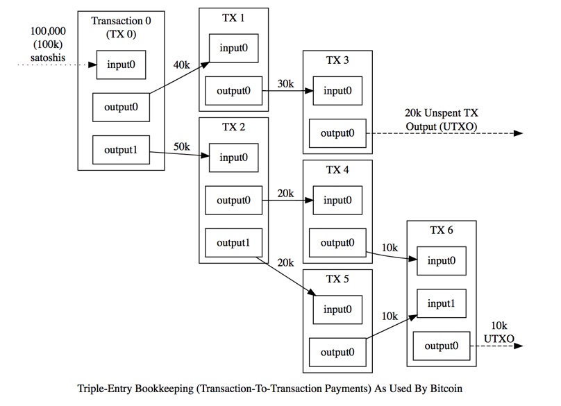

# Chapter 5: UTXO Transaction Model

> To allow value to be split and combined, transactions contain multiple inputs and outputs. Normally there will be either a single input from a larger previous transaction or multiple inputs combining smaller amounts, and at most two outputs: one for the payment, and one returning the change, if any, back to the sender. - Bitcoin's Whitepaper

We have been using Account Balance transaction model so far. In Bitcoin, transactions work differently. In each transaction, there are inputs and outputs. The output of a transaction records the addresses and amount to send to. Each input to a transaction provides evidence to consume an output from a previous transaction. 

Any output that can be spent are called **Unspent Transaction Output** (UTXO).

In practice, the balance of an address in the account transaction model is stored in a global state. In the UTXO model, it is the sum of all UTXO of an address.

## 3 Rules of UTXO model

* Every transaction must prove that the sum of its inputs are greater than the sum of its outputs. 
* Every referenced input must be valid and not yet spent.
* The transaction must produce a signature matching the owner of the input.


*Image Credit: bitcoin.org*

Let us update our Transaction, replacing toAddress and fromAddress by txIn and txOut.

[Transaction.go](Transaction.go)

We also need to create the input struct

[TxIn.go](TxIn.go)

and output struct

[TxOut.go](TxOut.go)

To make life easy for us when getting the balance of all addresses, we create another new UTXO class.

[UTXO.go](UTXO.go)

Before we move on, let us recap some basic concepts:
 
* Each CHAIN consists of blocks. 
* Each BLOCK consists of transactions.
* Each TRANSACTIONS consists of inputs and outputs.

## Updating our Blockchain

With all these changes, we need to update our Blockchain code. As an example, let us premine 3 outputs - 30 and 20 and 10 coins to Alice

[Blockchain.go](Blockchain.go)

Now in main.go

[main.go](main.go)

Q1. Refer to the createTransaction endpoint in main.go. What problem can you see with the code here?

```
// Get the UTXO and decide how many utxo to sign.
utxos := blockchain.getUtxo(result["fromAddress"].(string))
var accumulatedUTXOVal float32 = 0
var requiredUTXOs []UTXO
for _, utxo := range utxos {
    requiredUTXOs = append(requiredUTXOs, utxo)
    accumulatedUTXOVal += utxo.Value
    if accumulatedUTXOVal - float32(result["value"].(float64)) > 0 {
        break
    }
}
```

Q2. Refer to the createTransaction endpoint in main.go. What problem can you see with the code here?

```
// lets spend the the UTXO by signing them. What is wrong with this?
for _, requireUTXO := range requiredUTXOs {
    sign := wallet.sign([]byte(requireUTXO.TxOutHash), privByte)
    if wallet.verifySignature([]byte(requireUTXO.TxOutHash), sign, pubByte) {
        txIn := TxIn {
            TxOutIndex: requireUTXO.TxOutIndex,
            TxOutHash: requireUTXO.TxOutHash,
            Signature: hex.EncodeToString(sign),
        }
        requiredUTXOValue += requireUTXO.Value
        txIns = append(txIns, txIn)
    } else {
        w.WriteHeader(http.StatusBadRequest)
        w.Write([]byte("You are not the owner of the funds!\n"))
        return
    }
}
```

## Testing

A quick reminder.

```
# Alice
Private Key: 9bda80432dbd72a7a20f9411fb9fb5c4cee2021ffe7d869f6199878606cadf45
 Public Key: 4b83487732a84f3963bd20f61341a1a69fd9d5db6be47d0f9d92015baf8848b3beb0c447ed24b7e0b5adc310da9b6cc5f482c53bf04508f72dd7cd4818006906

# Bob
Private Key: 24e7156eb547842ad49d585f9d77962703a49e818bc3ebbd97f5a2882d3e8f01
 Public Key: 5a51771e00a504d488f74431ac9852dca16c986aa7abbca3c2a0a62e8051062cf8db388015aae7b30585ad4a4f5510a7936aa216bde10dc7884db245ceeecca0

# Miner
Private Key: 49539af0fa3b05887e716f1c349c2ceb3782f81d03681f87bf459c2f54096215
 Public Key: 2466503911b6ac3db8d98642687754b151a1d016d6dbe565d463719b034d1731820027e2b1c0e54d16ddd9eb8df44ba788140920b0ebbd46096d5363c5826031

```

Its time to simulate the scenario.

In Terminal 1, start the node

```
$ ./blockchain
```

In Terminal 2, start the node

```
$ PEER_NO=1 PEER=ws://localhost:6000 ./blockchain
```

In Terminal 3, start the node

```
$ PEER_NO=2 PEER=ws://localhost:6001 ./blockchain
```

In Terminal 4, 

```
# Note: I have left some minor errors in the code displayed in this chapter. Fix them as you go through the test.

# Get UTXO of Alice in node 3. In terminal 4,
curl http://localhost:3002/getUtxo/4b83487732a84f3963bd20f61341a1a69fd9d5db6be47d0f9d92015baf8848b3beb0c447ed24b7e0b5adc310da9b6cc5f482c53bf04508f72dd7cd4818006906

# Get Alice balance. it should be 60
curl http://localhost:3000/getBalance/4b83487732a84f3963bd20f61341a1a69fd9d5db6be47d0f9d92015baf8848b3beb0c447ed24b7e0b5adc310da9b6cc5f482c53bf04508f72dd7cd4818006906

# Alice send 31 coins to bob in Node 3. In terminal 4
curl -H "Content-type:application/json" --data '{"fromAddress" :"4b83487732a84f3963bd20f61341a1a69fd9d5db6be47d0f9d92015baf8848b3beb0c447ed24b7e0b5adc310da9b6cc5f482c53bf04508f72dd7cd4818006906", "toAddress": "5a51771e00a504d488f74431ac9852dca16c986aa7abbca3c2a0a62e8051062cf8db388015aae7b30585ad4a4f5510a7936aa216bde10dc7884db245ceeecca0", "value": 31, "data": "i love BTC", "privKey": "9bda80432dbd72a7a20f9411fb9fb5c4cee2021ffe7d869f6199878606cadf45"}' http://localhost:3002/createTransaction

# Node 3 now mines a block. In terminal 4,
curl -H "Content-type:application/json" --data '{"minerAddress":"2466503911b6ac3db8d98642687754b151a1d016d6dbe565d463719b034d1731820027e2b1c0e54d16ddd9eb8df44ba788140920b0ebbd46096d5363c5826031"}' http://localhost:3002/mineBlock

# Alice balance. It should be 29
curl http://localhost:3000/getBalance/4b83487732a84f3963bd20f61341a1a69fd9d5db6be47d0f9d92015baf8848b3beb0c447ed24b7e0b5adc310da9b6cc5f482c53bf04508f72dd7cd4818006906

# Bob balance. It should be 31
curl http://localhost:3000/getBalance/5a51771e00a504d488f74431ac9852dca16c986aa7abbca3c2a0a62e8051062cf8db388015aae7b30585ad4a4f5510a7936aa216bde10dc7884db245ceeecca0

# miner balance. It should be 12.5
curl http://localhost:3000/getBalance/2466503911b6ac3db8d98642687754b151a1d016d6dbe565d463719b034d1731820027e2b1c0e54d16ddd9eb8df44ba788140920b0ebbd46096d5363c5826031

# check the chain in all the nodes. They should be the same
curl http://localhost:3002/getBlockchain
curl http://localhost:3001/getBlockchain
curl http://localhost:3000/getBlockchain
```

Tip: Remember to commit your code before moving on to the next chapter.

## Short Quiz

? In a Bitcoin transaction, why is the sum of output always lesser than the sum of input?

a) Because the input need to include the transaction fees
B) Because the output need to include the transaction fees
c) Because this is just the way it works in Bitcoin

? What happens if Alice uses 1 UTXO (30 coins) to send 1 mycoin to Bob and doesn't provide change address?

A) The miner gets Alice's 29 coins.
b) Alice UTXO is now updated to 29 coins.
c) Bob gets an extra 29 coins.
d) No one gets the 29 coins. Its lost forever.

## Resources

* [Bitoin transactions](https://bitcoin.org/en/developer-guide#transactions)
* [Optimising UTXO](https://medium.com/@lopp/the-challenges-of-optimizing-unspent-output-selection-a3e5d05d13ef)