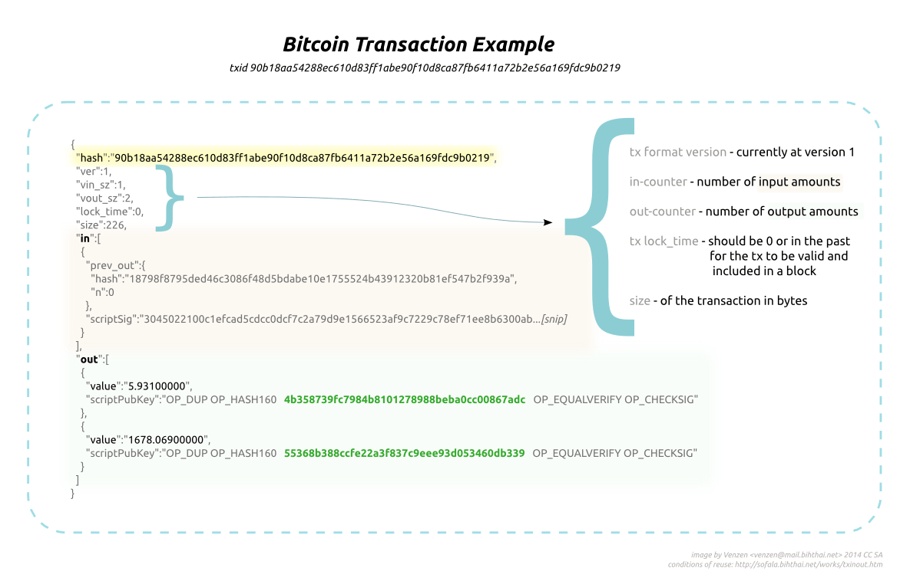

# Chapter 5: Smart Contracts

> A smart contract is a computerized transaction protocol that executes the terms of a contract. The general objectives are to satisfy common contractual conditions (such as payment terms, liens, confidentiality, and even enforcement), minimize exceptions both malicious and accidental, and minimize the need for trusted intermediaries. Related economic goals include lowering fraud loss, arbitrations and enforcement costs, and other transaction costs. - "The Idea of Smart Contracts" by Nick Szabo


A good analogy of how a Smart Contract work is like using a coin to rent a trolley. You stake something of value (a coin) and get it back until certain condition is fulfilled (you return the trolley). Think of how we could have done this by just employing a person to take down details of the renter and watch out for them when they leave the shop and making sure they return the trolley.

This course wouldn't be complete wouldn't talking about Bitcoin Script.

Bitcoin comes with a [non-turing complete](https://simple.wikipedia.org/wiki/Turing_complete) Smart Contract capability which gives Bitcoin [basic Bitcoin Scripting](https://en.bitcoin.it/wiki/Script) capabilities to create simple [DAPPS](https://www.coindesk.com/information/what-is-a-decentralized-application-dapp/). Decentralised apps is commonly known as Web 3.0 and will become very powerful when combined with AI. 

People are usually unaware, but sending funds from one person to another in Bitcoin usually requires some scripting. One such popular script is called [P2PKH](https://bitcoin.org/en/glossary/p2pkh-address)

P2PKH is a simple Bitcoin script and a Smart Contract. The rule is that the receiver is allowed to spend the funds only if they can proof their ownership of the funds creating a signature with their private key. In the previous chapters, we have done this in the createTransaction api. To do it professionally, it needs to be in the mycoin protocol.

## Stack Machine

Before diving into P2PKH script, let us talk a bit about [stack machine](https://en.wikipedia.org/wiki/Stack_machine)

Bitcoin script is programmed in [RPN (Reverse Polish Notation)](https://en.wikipedia.org/wiki/Reverse_Polish_notation) in the stack machine.

In normal arithmetic,

```
// Answer is 14. we do multiplication before addition.
10 + 2 * 2
```

In RPN,

```
// Answer is also 14. We executes arithmetic in a stack
2 2 * 10 + 
```

## P2PKH (Pay to Public Key Hash)


*Image Credit: bitcoin.org*

There are 2 parts to a real Bitcoin transaction:

* Input Script: aka as scriptsig, signature script or unlocking script.
* Output Script: aka scriptPubkey, pubkey script or locking script.

The code in the P2PKH output script is usually,

```
OP_DUP OP_HASH160 <PubkeyHash> OP_EQUALVERIFY OP_CHECKSIG
```

where PubkeyHash is the target address.

To spend the funds in the output, the target address has to provide the input to the output, ie

```
<Sig> <PubKey> OP_DUP OP_HASH160 <PubkeyHash> OP_EQUALVERIFY OP_CHECKSIG
```

where Sig is the signature of the target user and Pubkey is the public key of the target user.

Let's say the sender is Alice and the Receiver is Bob.

* Bob's sig is pushed to the stack first, meaning its at the lowest.
* Bob's public key added next.
* The op code OP_DUP duplicates the public key.
* OP_HASH160 does a [ripmd160](https://en.wikipedia.org/wiki/RIPEMD) on the top public key.
* Duplicated PubKey is replaced by Bob's Pubkeyhash.
* OP_EQUAL verifies that 2 top Pubkeyhash are identical. If yes, it replaces **both entries** by a true. If not, it replaces both entries as a false.
* OP_VERIFY checks the value at the top of the stack. If false, script is terminated. If true, it pops the true off the stack.
* OP_CHECKSIG now checks the Pubkey, all data required to be signed and the signature comes from the same person.



Refer to this sample [Bitcoin transaction](https://www.blockchain.com/btc/tx/9333d664ca86cba1754403841a9ac5800b85e1140609206be236dc3fe1917aef) as an example.

## Making MyCoin Smart

In our course, we also want to add some simple scripting capabilities to our coin but not like the Bitcoin Script. Let's just say we want to allow the data field to be smart, ie we want the transaction output to be able to execute mycoin script. Mycoin script is basically just wrapped in the mycoin tag

in [Blockchain.go](Blockchain.go)
```
    func (this *Blockchain) mineBlock(minerAddress string) Block {
        ...
        // run smart contract
        this.runSmartContract(block)

        // start mining
        block.mineBlock(this.difficulty)

        ...
    }

    func (this Blockchain) runSmartContract(block *Block) error {
        // lets try to execute script in the outputs in the mined block
        for _, tx := range block.Transactions {
            for _, txOut := range tx.TxOut {

                matched, _ := regexp.MatchString(`<mycoin>(.*?)</mycoin>`, txOut.Data)
                if !matched {
                    continue
                }

                reg, err := regexp.Compile(`<mycoin>(.*?)</mycoin>`)
                if err != nil {
                    return err
                }
                data := reg.ReplaceAllString(txOut.Data, "${1}")

                expr, err := eval.ParseString(data,"")
                if err != nil{
                    return err
                }
                r, err := expr.EvalToInterface(nil)
                if err != nil {
                    return err
                }
                log.Println(r)
            }
        }
        return nil
    }
```

Q1. In the mineBlock function, is it ok to run `this.runSmartContract(block)` after `block.mineBlock(this.difficulty)` ?

With mycoin scripting supported, we just doing simple things that can demo for this article, not complicated computing as same as other turing complete programming languages. For example, calculate an expression below

```
<mycoin>1 + 1</mycoin>
```

Its time to try it out.

## Testing

A quick reminder.

```
# Alice
Private Key: 9bda80432dbd72a7a20f9411fb9fb5c4cee2021ffe7d869f6199878606cadf45
 Public Key: 4b83487732a84f3963bd20f61341a1a69fd9d5db6be47d0f9d92015baf8848b3beb0c447ed24b7e0b5adc310da9b6cc5f482c53bf04508f72dd7cd4818006906

# Bob
Private Key: 24e7156eb547842ad49d585f9d77962703a49e818bc3ebbd97f5a2882d3e8f01
 Public Key: 5a51771e00a504d488f74431ac9852dca16c986aa7abbca3c2a0a62e8051062cf8db388015aae7b30585ad4a4f5510a7936aa216bde10dc7884db245ceeecca0

# Miner
Private Key: 49539af0fa3b05887e716f1c349c2ceb3782f81d03681f87bf459c2f54096215
 Public Key: 2466503911b6ac3db8d98642687754b151a1d016d6dbe565d463719b034d1731820027e2b1c0e54d16ddd9eb8df44ba788140920b0ebbd46096d5363c5826031

```

In Terminal 1, start the node

```
$ make
$ ./blockchain
```

In Terminal 2, start the node

```
$ PEER_NO=1 PEER=ws://localhost:6000 ./blockchain
```

In Terminal 3, start the node

```
$ PEER_NO=2 PEER=ws://localhost:6001 ./blockchain
```

In Terminal 4, 

```
# Alice send 31 coins to bob in Node 3 with a twist in the data field. In terminal 4
curl -H "Content-type:application/json" --data '{"fromAddress" :"4b83487732a84f3963bd20f61341a1a69fd9d5db6be47d0f9d92015baf8848b3beb0c447ed24b7e0b5adc310da9b6cc5f482c53bf04508f72dd7cd4818006906", "toAddress": "5a51771e00a504d488f74431ac9852dca16c986aa7abbca3c2a0a62e8051062cf8db388015aae7b30585ad4a4f5510a7936aa216bde10dc7884db245ceeecca0", "value": 31, "data": "<mycoin>1+1</mycoin>", "privKey": "9bda80432dbd72a7a20f9411fb9fb5c4cee2021ffe7d869f6199878606cadf45"}' http://localhost:3002/createTransaction

# Node 3 now mines a block. In terminal 4,
curl -H "Content-type:application/json" --data '{"minerAddress":"2466503911b6ac3db8d98642687754b151a1d016d6dbe565d463719b034d1731820027e2b1c0e54d16ddd9eb8df44ba788140920b0ebbd46096d5363c5826031"}' http://localhost:3002/mineBlock

# Alice balance. It should be 29
curl http://localhost:3000/getBalance/4b83487732a84f3963bd20f61341a1a69fd9d5db6be47d0f9d92015baf8848b3beb0c447ed24b7e0b5adc310da9b6cc5f482c53bf04508f72dd7cd4818006906

# Bob balance. It should be 31
curl http://localhost:3000/getBalance/5a51771e00a504d488f74431ac9852dca16c986aa7abbca3c2a0a62e8051062cf8db388015aae7b30585ad4a4f5510a7936aa216bde10dc7884db245ceeecca0

# miner balance. It should be 12.5
curl http://localhost:3000/getBalance/2466503911b6ac3db8d98642687754b151a1d016d6dbe565d463719b034d1731820027e2b1c0e54d16ddd9eb8df44ba788140920b0ebbd46096d5363c5826031

# check the chain in all the nodes. They should be the same
curl http://localhost:3002/getBlockchain
curl http://localhost:3001/getBlockchain
curl http://localhost:3000/getBlockchain
```

Q2. Let's just say Mycoin Script is a new upgrade to Mycoin. Can you see any problems with this upgrade?

## Short Quiz

? In a stack machine, What does the stack `2 2 2 2` returns?

A) 2
b) 4
c) 6
d) 8
e) 16

? What are the benefits of Non-Turing Complete languages

a) More predictable resource usage
b) lesser loopholes for hacks to occur
c) Easier to debug
D) All of the above

## Resources
  
  * [Bitcoin Script](https://bitcoin.org/en/developer-guide#transactions)
  * [How Bitcoin address is generated](https://en.bitcoin.it/wiki/Technical_background_of_version_1_Bitcoin_addresses)